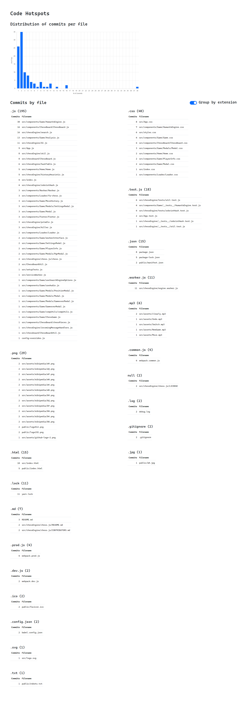

## Purpose

To find which files are the most commited to in a repository.

## To run

Start the server

```sh
npm run server
```

Start the client

```sh
npm run client
```

Open http://localhost:3000.
You can provide the path to the git repo to be analyzed in `./src/client/src/constants.js`

## Screenshot


